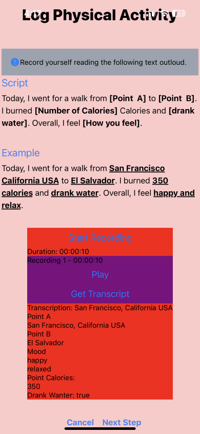
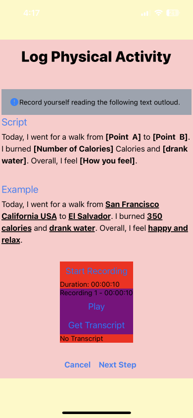
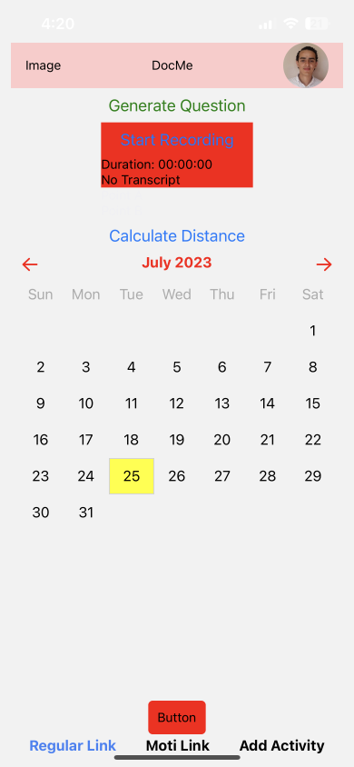

# Solito + NativeWind Example Monorepo 🕴

## Prototype Images + Demo ##

#Second Iteration
[https://youtube.com/shorts/yHmSruefv3s?feature=share]

#First Iteration
[https://youtu.be/BU8nhbpDSf4]

### Prototype - Demo (Audio transcription feature to automate Log Entry ###

DocuMe is a revolutionary cross-platform health application designed to empower non-technical users to effortlessly maintain their health records and track their well-being. Available on Web, Android, and iOS, HealthTrack offers a user-friendly interface that makes it remarkably easy to input and organize medical data, ensuring that all vital health information is conveniently accessible in one secure place.

https://github.com/gasper94/DocMe/assets/18272791/f4ca087f-26cd-4c94-9c2d-d9690f1826bc




Key Features:

Streamlined Data Input: HealthTrack prioritizes simplicity, allowing users to quickly input health-related information such as dental records, exercise routines, doctor appointments, and mental health observations without any technical expertise required. The intuitive user interface guides users through the process, making data entry a breeze.

All-in-One Health Profile: HealthTrack eliminates the need for multiple health-related apps by consolidating all essential health data into a unified profile. From dental checkups and exercise logs to upcoming doctor appointments and mood journals, users can conveniently access and manage their health information from any device.

Cross-Platform Accessibility: With support for Web, Android, and iOS platforms, HealthTrack ensures seamless synchronization of health records across devices. Users can input data on one platform and instantly access it on any other, ensuring they never miss important updates.

Reminders and Notifications: HealthTrack features customizable reminders and notifications for upcoming doctor appointments, recommended dental checkups, medication schedules, and exercise routines. This feature helps users stay on track with their health goals and never miss important healthcare commitments.

Data Security and Privacy: HealthTrack places a high emphasis on data security and privacy. All health records and personal information are encrypted to ensure confidentiality, and robust security measures protect against unauthorized access.

Comprehensive Data Visualization: HealthTrack offers interactive graphs and charts that provide insightful visualizations of health data over time. Users can monitor trends, identify patterns, and make informed decisions to enhance their overall well-being.

User Support and Assistance: The app's support feature provides users with assistance whenever needed. Non-technical users can easily reach out to a friendly customer support team to resolve queries or seek guidance on utilizing the app's features effectively.

HealthTrack revolutionizes health profile management, catering specifically to non-technical users. By prioritizing ease of data input and cross-platform accessibility, the app ensures that everyone can effortlessly take charge of their health, making informed decisions for a healthier and happier life. Say goodbye to fragmented health data and welcome the simplicity and convenience of HealthTrack into your daily health routine.


```sh
npx create-solito-app@latest my-solito-app -t with-tailwind
```

And just like that, you now have an Expo + Next.js app that is styled with Tailwind CSS.

## ⚡️ Instantly clone & deploy

[](https://vercel.com/new/clone?repository-url=https%3A%2F%2Fgithub.com%2Fnandorojo%2Fsolito%2Ftree%2Fmaster%2Fexample-monorepos%2Fwith-tailwind&root-directory=apps/next&envDescription=Set%20this%20environment%20variable%20to%201%20for%20Turborepo%20to%20cache%20your%20node_modules.&envLink=https%3A%2F%2Ftwitter.com%2Fjaredpalmer%2Fstatus%2F1488954563533189124&project-name=solito-app&repo-name=solito-app&demo-title=Solito%20App%20%E2%9A%A1%EF%B8%8F&demo-description=React%20Native%20%2B%20Next.js%20starter%20with%20Solito.%20Made%20by%20Fernando%20Rojo.&demo-url=https%3A%2F%2Fsolito.dev%2Fstarter&demo-image=https%3A%2F%2Fsolito.dev%2Fimg%2Fog.png&build-command=cd+..%2F..%3Bnpx+turbo+run+build+--filter%3Dnext-app)

## 🔦 About

This monorepo is a starter for an Expo + Next.js app using [NativeWind](https://nativewind.dev) for its styling & [Solito](https://solito.dev) for navigation.

## 👓 How NativeWind works with Solito

### Fast on every platform

NativeWind lets you use Tailwind while reducing runtime work on every platform.

### iOS and Android

Most approaches to using Tailwind in React Native do something like this at runtime:

```ts
const styles = props.className
  .split(' ')
  .map((className) => makeStyle(className))

return <View style={styles} />
```

This means that every component ends up parsing strings to construct predictable style objects.

NativeWind takes a new approach by doing this work upfront with a Babel plugin.

NativeWind turns `className` strings into cached `StyleSheet.create` objects at build time, avoiding the [slow string parsing problem](https://twitter.com/terrysahaidak/status/1470735820915150850?s=20&t=w9VUPwiTFxBkRBHWTtDz1g) of libraries like `styled-components/native`.

Keep in mind that the Babel plugin will get used on iOS/Android only; on Web, we don't need the plugin since we are using `className`.

### Web

On Web, NativeWind uses Next.js' `PostCSS` feature to output CSS StyleSheets.

Which means that **on Web, you're using CSS class names.**

Yes, that's right. We aren't parsing className strings into objects for React Native Web to use. Instead, we're actually forwarding CSS classnames to the DOM. That means you can get responsive styles, dark mode support, & pseudo-selectors _with server-side rendering support_.

This is finally possible with the release of React Native Web 0.18.

As a result, using NativeWind with React Native doesn't have significant overhead compared to plain old Tailwind CSS in a regular React app.

If you're planning on making a website with Tailwind, why not use Solito with NativeWind?

You might accidentally make a great native app when you thought you were just making a website.

### Bringing it together

Components are written using the `styled()` higher-order component.

In your app's design system, you can start by building your own UI primitives:

```tsx
// packages/app/design/typography
import { Text } from 'react-native'
import { styled } from 'nativewind'

export const P = styled(Text, 'text-base text-black my-4')
```

Notice that you can set base styles using the second argument of `styled`.

You can then use the `className` prop, just like regular Tailwind CSS:

```tsx
<P className="dark:text-white">Solito + NativeWind</P>
```

Take a look at the [`packages/app/design`](https://github.com/nandorojo/solito/tree/master/example-monorepos/with-tailwind/packages/app/design) folder to see how components are created with ease.

> If you're reading the NativeWind docs, you might find that you can use `className` directly without using `styled`. Since this requires the Babel plugin for all platforms, it won't work with Solito. Be sure to always wrap your components with `styled`.

## 📦 Included packages

- `solito` for cross-platform navigation
- `moti` for animations
- `nativewind` for theming/design (you can bring your own, too)
- Expo SDK 48
- Next.js 13
- React Navigation 6

## 🗂 Folder layout

- `apps` entry points for each app

  - `expo`
  - `next`

- `packages` shared packages across apps
  - `app` you'll be importing most files from `app/`
    - `features` (don't use a `screens` folder. organize by feature.)
    - `provider` (all the providers that wrap the app, and some no-ops for Web.)
    - `navigation` Next.js has a `pages/` folder. React Native doesn't. This folder contains navigation-related code for RN. You may use it for any navigation code, such as custom links.
    - `design` your app's design system. organize this as you please.
      - `typography` (components for all the different text styles)
      - `layout` (components for layouts)

You can add other folders inside of `packages/` if you know what you're doing and have a good reason to.

## 🏁 Start the app

- Install dependencies: `yarn`

- Next.js local dev: `yarn web`
  - Runs `yarn next`
- Expo local dev:
  - First, build a dev client onto your device or simulator
    - `cd apps/expo`
    - Then, either `expo run:ios`, or `eas build`
  - After building the dev client, from the root of the monorepo...
    - `yarn native` (This runs `expo start --dev-client`)

## 🆕 Add new dependencies

### Pure JS dependencies

If you're installing a JavaScript-only dependency that will be used across platforms, install it in `packages/app`:

```sh
cd packages/app
yarn add date-fns
cd ../..
yarn
```

### Native dependencies

If you're installing a library with any native code, you must install it in `apps/expo`:

```sh
cd apps/expo
yarn add react-native-reanimated

cd ../..
yarn
```

You can also install the native library inside of `packages/app` if you want to get autoimport for that package inside of the `app` folder. However, you need to be careful and install the _exact_ same version in both packages. If the versions mismatch at all, you'll potentially get terrible bugs. This is a classic monorepo issue. I use `lerna-update-wizard` to help with this (you don't need to use Lerna to use that lib).

## 🎙 About the creator

### Fernando Rojo

Follow Fernando Rojo, creator of `solito`, on Twitter: [@FernandoTheRojo](https://twitter.com/fernandotherojo)

### Mark Lawlor

Follow Mark Lawlor, creator of `NativeWind`, on Twitter: [@mark\_\_lawlor](https://twitter.com/mark__lawlor)

## 🧐 Why use Expo + Next.js?

See my talk about this topic at Next.js Conf 2021:

<a href="https://www.youtube.com/watch?v=0lnbdRweJtA">
</a>


### ICONS

[https://snack.expo.dev/?platform=web] https://snack.expo.dev/?platform=web

When searching for an icon pack, use an SVG-based icon library with proper tree shaking, not a font-based library.

Recommendation
Take a folder (or multiple folders) of SVG icons

For each icon, turn it into a component using react-native-svg in its own file.

a. SVGR is a preferred tool for this. You can create a node script that handles this for you.

Export each icon as its own module for proper tree shaking.

Install react-native-svg (and any library which wraps it) and add them to transpilePackages in next.config.js. You'll need to rebuild your Expo Dev Client if you aren't using Expo Go.

You can also find many of these libraries on GitHub/NPM. Here are two open source examples (but there are many others too):

@nandorojo/heroicons
@nandorojo/iconic
